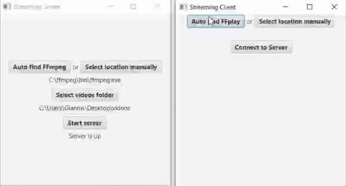

# video-streaming-system
A system consisted of 3 applications responsible for conversion, communication between them and video streaming. A core element is **ffmpeg** (https://ffmpeg.org/download.html) which is used to perform the conversion of a video file in a desired format and bitrate, and also to perform the streaming of a video to a desired network address.

## Technologies
* **Java 8**
* **JavaFX** framework

## Use case

## Visuals
* StreamDirector application - converts the videos to the initial formats and bitrates.

  
Click to see it in action

  

 

* StreamingServer application - contains the videos to be streamed and implements the server logic.

  
Click to see it in action

  

 

* StreamingClient application - communicates with the server to request a subset of the available videos and to begin the video streaming.
Bale 2 gif - to ena na deixnei thn arxikh roh tou client, to 2o ta upoloipa

  
Click to see it in action

  

## Features
* Built with MVC Architecture Pattern.

## Notes
University project for the course of _Multimedia and Multimedia Communications_.
