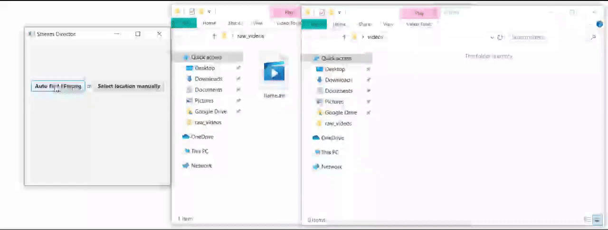
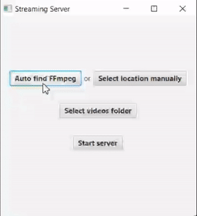
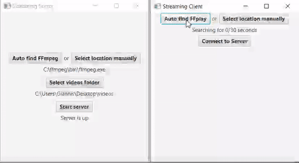
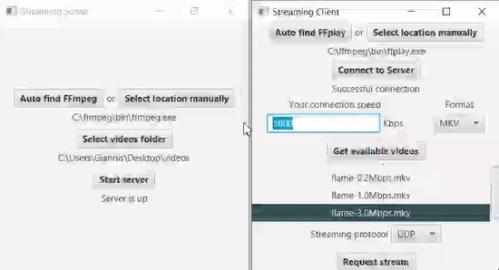

  A system consisted of 3 applications responsible for conversion, communication between them and video streaming.

 

## Technologies
* **Java 8**
* **JavaFX** framework
* **FFmpeg**
 

## Installation
1. Download and install **ffmpeg** (https://ffmpeg.org/download.html).
2. Run the _.jar_ files of the applications (located in _Releases_).
3. That's it!
 
To log messages generated by the applications, run the _.jar_ files from a console (`java -jar <application-name>.jar`).

 

## Visuals
* **StreamDirector** application - converts a video to 3 formats (_avi_, _mp4_, _mkv_) and 4 bitrates (_0.2Mbps_, _0.5Mbps_, _1Mbps_, _3Mbps_) (a total of 12 outputs).

  
Click to see it in action

  

    
    
   <i>(GIF - Duration: 19 seconds)</i>
  

 

* **StreamingServer** application - accesses the videos to be streamed and implements the server logic.

  
Click to see it in action

  

    
     
    <i>(GIF - Duration: 8 seconds)</i>
  

 

* **StreamingClient** application - communicates with the server to request a subset of the available videos and to then request the streaming of a specific video.

  
Click to see it in action

  

      
    <b>1. Initial flow</b> 
     
    <i>(GIF - Duration: 15 seconds)</i>
  

   
  
  

      
    <b>2. Changing connection speed, video format and streaming protocol</b>
     
    <i>(GIF - Duration: 18 seconds)</i>
  

 

## Features
* _New:_ Locate the path to _ffmpeg_'s directory on the user's computer automatically, without the user having to declare it in any system variable.
* Server-Client communication is performed using _sockets_ and _threads_. The server can accept and will respond to multiple different requests from a client. Supports **TCP** and **UDP** communication protocols.
* The system can extract information from the title of a video which is of type _videoName_-_bitrate_._format_ (eg The.Invisible.Guest-3.0Mbps.mp4).
* The client receices a list with videos that have a bitrate less or equal with his/her connection speed.
* Built with **MVC Architecture Pattern**.
 

## Notes
University project for the course of _Multimedia and Multimedia Communications_. It is built to work on windows machines.
